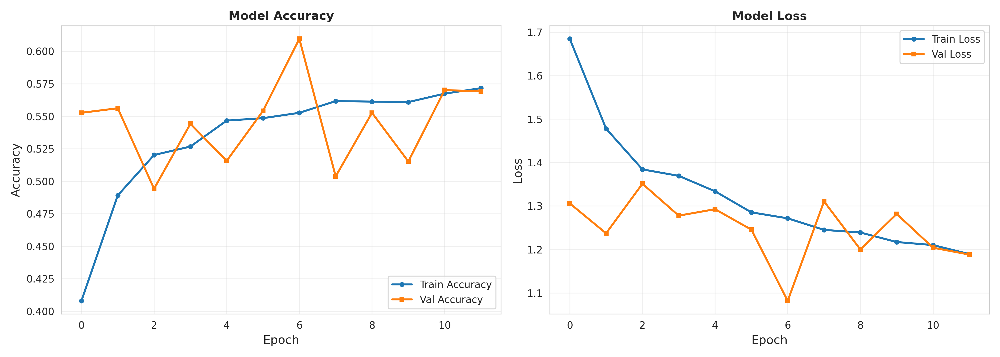
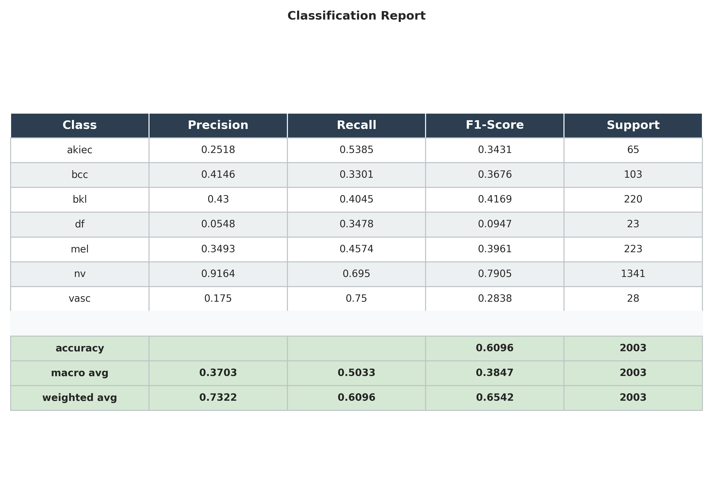
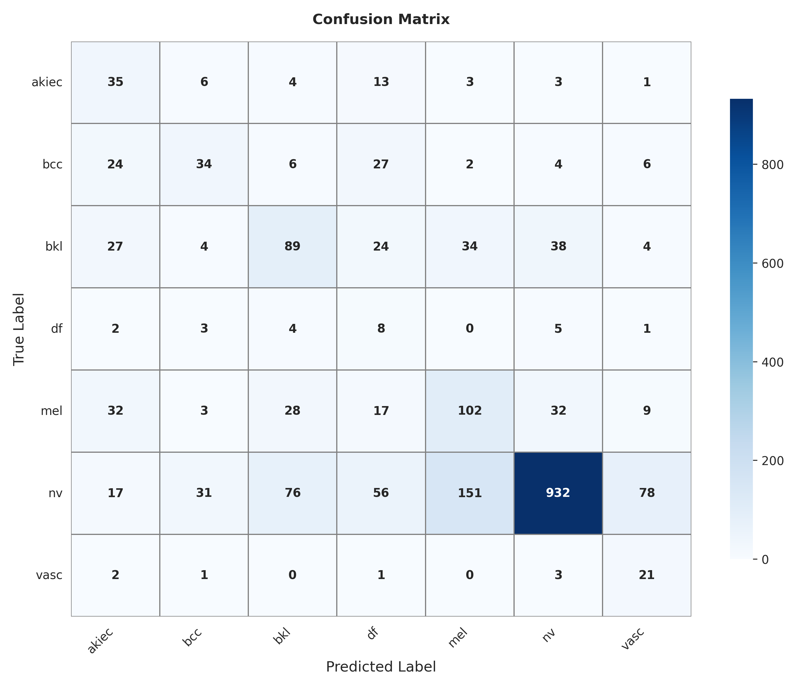
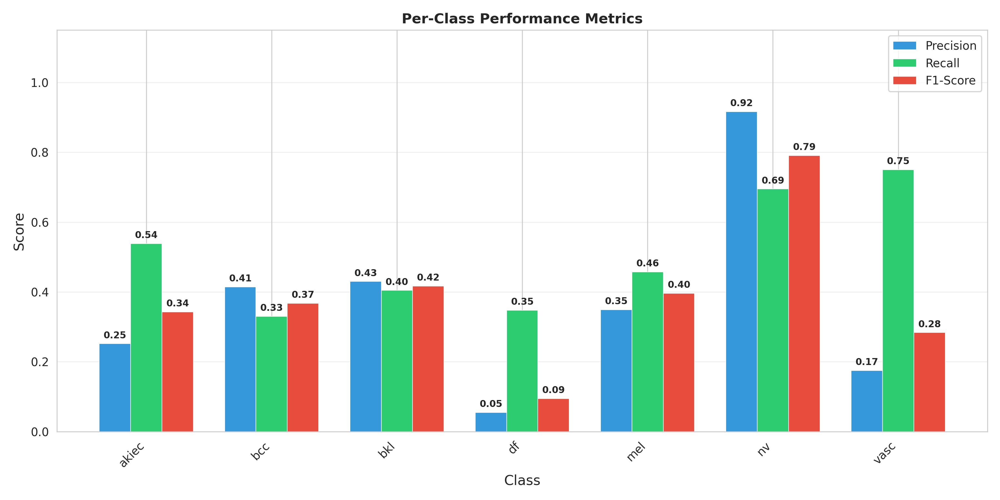

<div align="center">

# 🩺 AI Skin Disease Detection System

### Deep Learning-Powered Dermatoscopic Image Classification with Explainable AI

[](https://www.python.org/)
[](https://www.tensorflow.org/)
[](https://flask.palletsprojects.com/)
[](LICENSE)

An end-to-end deep learning system that classifies skin lesions into **7 disease categories** using **EfficientNetV2**, with **Grad-CAM** visual explanations and a modern **Flask web interface**.

</div>

---

## ✨ Key Features

| Feature | Description |
|---------|-------------|
| 🧠 **EfficientNetV2B0 Backbone** | Transfer learning from ImageNet with custom classification head |
| 🔍 **Grad-CAM Explainability** | Heatmap visualizations showing which skin regions drive the model's decisions |
| 🌐 **Modern Web Interface** | Dark-themed glassmorphism dashboard with animated confidence gauge |
| 📊 **7-Class Classification** | Covers the major dermatoscopic disease categories from HAM10000 |
| 📈 **Training Visualization** | Accuracy/loss curves, confusion matrix, and per-class performance charts |
| ⚡ **Real-time Inference** | Upload an image and get instant diagnosis with confidence scores |

---

## 📋 Disease Categories

The model classifies skin lesions into the following **7 categories** based on the HAM10000 schema:

| Code | Full Name | Description | Risk Level |
|------|-----------|-------------|:----------:|
| `akiec` | Actinic Keratoses | Rough, scaly patches from sun exposure; precancerous | ⚠️ Moderate |
| `bcc` | Basal Cell Carcinoma | Most common skin cancer; slow-growing but destructive | 🔴 High |
| `bkl` | Benign Keratosis-like Lesions | Seborrheic keratoses, solar lentigines; non-cancerous | 🟢 Low |
| `df` | Dermatofibroma | Firm, small benign skin nodules; usually harmless | 🟢 Low |
| `mel` | Melanoma | Most dangerous skin cancer; can spread rapidly | 🔴 High |
| `nv` | Melanocytic Nevi | Common moles; benign melanocyte growths | 🟢 Low |
| `vasc` | Vascular Lesions | Cherry angiomas, angiokeratomas; benign vascular conditions | 🟢 Low |

---

## 📂 Dataset Overview

The project uses the **DermaMNIST** dataset (derived from the HAM10000 dataset schema). The metadata file `data/HAM10000_metadata.csv` contains **10,015 samples** with the following distribution:

| Class | Samples | Percentage | Distribution |
|-------|--------:|:----------:|:-------------|
| Melanocytic nevi (nv) | 6,705 | 66.9% | ████████████████████████████████▌ |
| Melanoma (mel) | 1,113 | 11.1% | █████▌ |
| Benign keratosis (bkl) | 1,099 | 11.0% | █████▌ |
| Basal cell carcinoma (bcc) | 514 | 5.1% | ██▌ |
| Actinic keratoses (akiec) | 327 | 3.3% | █▌ |
| Vascular lesions (vasc) | 142 | 1.4% | ▌ |
| Dermatofibroma (df) | 115 | 1.1% | ▌ |

> **Note:** The dataset is heavily imbalanced, with melanocytic nevi (nv) comprising ~67% of all samples. This is a known challenge in dermatoscopic datasets and reflects real-world clinical distribution.

### CSV Metadata Structure

The `data/HAM10000_metadata.csv` file has the following schema:

```
image_id,dx,lesion_id
DermaMNIST_train_00000,akiec,lesion_train_00000
DermaMNIST_train_00001,nv,lesion_train_00001
...
```

| Column | Description |
|--------|-------------|
| `image_id` | Unique identifier for each image (maps to `data/images/{image_id}.jpg`) |
| `dx` | Diagnosis label — one of the 7 disease codes listed above |
| `lesion_id` | Unique lesion identifier (multiple images may belong to the same lesion) |

---

## 🏗️ Model Architecture

```
EfficientNetV2B0 (ImageNet pretrained, frozen)
    ↓
GlobalAveragePooling2D
    ↓
Dropout (0.2)
    ↓
Dense (7, softmax) → Predictions
```

- **Base model:** `EfficientNetV2B0` with `include_top=False`
- **Input size:** `224 × 224 × 3`
- **Optimizer:** Adam (`lr=1e-3`)
- **Loss:** Sparse Categorical Crossentropy
- **Training:** Transfer learning — base layers frozen, only custom head is trained

---

## 📊 Model Performance & Results

### Training History

Accuracy and loss curves over 12 training epochs:



### Classification Report

Per-class precision, recall, F1-score on the test set (**2,003 samples**):

| Class | Precision | Recall | F1-Score | Support |
|-------|:---------:|:------:|:--------:|--------:|
| akiec | 0.2518 | 0.5385 | 0.3431 | 65 |
| bcc | 0.4146 | 0.3301 | 0.3676 | 103 |
| bkl | 0.4300 | 0.4045 | 0.4169 | 220 |
| df | 0.0548 | 0.3478 | 0.0947 | 23 |
| mel | 0.3493 | 0.4574 | 0.3961 | 223 |
| **nv** | **0.9164** | **0.6950** | **0.7905** | **1,341** |
| vasc | 0.1750 | 0.7500 | 0.2838 | 28 |
| | | | | |
| **Accuracy** | | | **0.6096** | **2,003** |
| **Macro Avg** | 0.3703 | 0.5033 | 0.3847 | 2,003 |
| **Weighted Avg** | 0.7322 | 0.6096 | 0.6542 | 2,003 |



### Confusion Matrix



### Per-Class Performance Comparison



> **Observations:**
> - **nv** (melanocytic nevi) achieves the best performance (F1: 0.79), benefiting from the largest sample count
> - **df** (dermatofibroma) struggles the most (F1: 0.09) due to extreme class imbalance (only 23 test samples)
> - **vasc** (vascular lesions) shows high recall (0.75) despite low precision, indicating the model detects them but with many false positives
> - Class imbalance is the primary challenge — techniques like oversampling, class weighting, or focal loss could improve minority-class performance

---

## 🛠️ Installation & Setup

### Prerequisites

- Python 3.8 or higher
- pip package manager

### Steps

1. **Clone the repository:**
   ```bash
   git clone https://github.com/mizanur-sajid/AI-Skin-Disease-Detection-System.git
   cd AI-Skin-Disease-Detection-System
   ```

2. **Install dependencies:**
   ```bash
   pip install -r requirements.txt
   ```

3. **Verify data directory:**
   Ensure `data/images/` contains the dermatoscopic image files and `data/HAM10000_metadata.csv` is present.

---

## 🚀 How to Use

### 1. Train the Model

Open and run `src/train.ipynb` (or execute `src/train.py`) to train the EfficientNetV2 model. The best model checkpoint is saved to `models/best_model.h5`.

```bash
python src/train.py
```

### 2. Visualize with Grad-CAM

Use `src/grad_cam.py` to generate heatmap overlays showing which regions of a skin image the model focuses on for its predictions.

### 3. Launch the Web App

```bash
python app.py
```

Then open **http://127.0.0.1:5000** in your browser. The web interface allows you to:

- **Upload** a skin lesion image (drag & drop or click to browse)
- **Analyze** the image with the trained EfficientNetV2 model
- **View** the predicted disease class with a confidence gauge
- **Explore** the Grad-CAM heatmap showing which regions influenced the diagnosis
- **Read** disease-specific information and risk level for the predicted condition

---

## 📁 Project Structure

```
AI-Skin-Disease-Detection-System/
│
├── app.py                              # Flask web application (main entry point)
├── requirements.txt                    # Python package dependencies
├── README.md                           # Project documentation (this file)
│
├── data/
│   ├── images/                         # Dermatoscopic images (.jpg)
│   ├── HAM10000_metadata.csv           # Labels and metadata (10,015 samples)
│   └── results/                        # Training results and evaluation plots
│       ├── training_history.png        # Accuracy/loss curves
│       ├── confusion_matrix.png        # 7×7 confusion matrix
│       ├── classification_report.csv   # Per-class metrics (CSV)
│       ├── classification_report.png   # Per-class metrics (visual)
│       └── per_class_performance.png   # Precision/recall/F1 bar chart
│
├── models/
│   └── best_model.h5                   # Trained model weights
│
├── src/
│   ├── data_loader.py                  # Data loading and augmentation pipeline
│   ├── model.py                        # EfficientNetV2B0 model definition
│   ├── train.py                        # Training script
│   ├── train.ipynb                     # Interactive training notebook
│   └── grad_cam.py                     # Grad-CAM heatmap generation
│
├── static/
│   ├── css/
│   │   └── style.css                   # Dark-themed glassmorphism design system
│   └── js/
│       └── script.js                   # Frontend logic (gauge, toasts, tabs)
│
└── templates/
    └── index.html                      # Web app HTML template
```

---

## 🧰 Tech Stack

| Layer | Technology |
|-------|-----------|
| **Deep Learning** | TensorFlow / Keras |
| **Model** | EfficientNetV2B0 (transfer learning) |
| **Explainability** | Grad-CAM |
| **Backend** | Flask |
| **Frontend** | HTML, CSS (glassmorphism), JavaScript |
| **Data Processing** | NumPy, Pandas, OpenCV, Pillow |
| **Visualization** | Matplotlib, scikit-learn |

---

## ⚠️ Disclaimer

This project is for **educational and research purposes only**. It is **not** a substitute for professional medical advice, diagnosis, or treatment. Always consult a qualified dermatologist for skin-related concerns.

---

<div align="center">

**Made with ❤️ by Mizanur Sajid**

</div>
